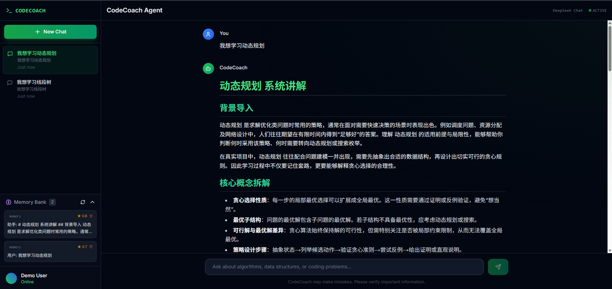

# 🎓 CodeCoach Agent

> 🌟 基于 Agent 的智能算法学习与评测系统 | Multi-Agent Algorithm Learning Platform

[]()
[](https://www.python.org/)
[](https://fastapi.tiangolo.com/)
[](https://nextjs.org/)
[]()

## 📖 项目简介 (Introduction)

CodeCoach Agent 是一个专为算法竞赛（如 ICPC, Codeforces）设计的 AI 辅助学习系统。它摒弃了传统的单体应用模式，采用 **前后端分离架构 (FastAPI + Next.js)**，结合 **Qdrant** 向量数据库和 **RAG (检索增强生成)** 技术，通过多个专业 Agent 的协作，为用户提供个性化的学习路径。

系统模拟了真实的教练指导流程：

1. **需求分析**: 理解你想学什么（如"动态规划"）。
2. **知识教学**: 生成结构化的学习内容。
3. **题目推荐**: 基于难度推荐 Codeforces 题目。
4. **代码评审**: 提供针对性的代码优化建议。


## ✨ 核心特性 (Features)

- 🤖 **多 Agent 协作架构**:
  - `CoreAgent`: 核心调度与意图识别
  - `RequirementAgent`: 需求分析与学习规划
  - `TeachingAgent`: 算法概念讲解与伪代码生成
  - `RecommendationAgent`: Codeforces 题目智能推荐
  - `ReviewAgent`: 代码逻辑分析与优化建议
- 🧠 **长期记忆 (Long-term Memory)**:
  - 基于 Qdrant 向量数据库，记录用户的学习历史与偏好。
  - 支持跨会话的上下文理解。
- 🔍 **RAG 混合检索**:
  - 结合 Dense (向量) + Sparse (BM25/SPLADE) 检索，提供精准的算法知识库支持。
- 💻 **现代化 UI**:
  - 基于 Next.js 14 构建的响应式界面，提供沉浸式聊天体验。
  
  
  *(CodeCoach Agent 交互界面：左侧为会话历史与记忆库，右侧为多 Agent 协作生成的结构化算法教学内容)*

- 📊 **学习追踪**:
  - 可视化展示学习进度与记忆摘要。

## 🏗️ 技术栈 (Tech Stack)

### Backend (Python)

- **Framework**: FastAPI
- **LLM Agent**: Hello-Agents Framework (Custom)
- **Vector DB**: Qdrant
- **RAG**: DashScope Embedding + SPLADE
- **Tools**: PyMurPup (PDF Parsing), Jieba (Tokenization)

### Frontend (TypeScript)

- **Framework**: Next.js 14 (App Router)
- **Styling**: Tailwind CSS
- **Components**: Lucide React

## 📂 项目结构 (Structure)

```bash
CodeCoach-Agent/
├── agents/                 # 🤖 Agent 智能体实现
│   ├── core_agent.py       # 核心调度器
│   ├── requirement.py      # 需求分析 Agent
│   ├── teaching.py         # 教学 Agent
│   ├── recommendation.py   # 题目推荐 Agent
│   └── ...
├── frontend/               # 🎨 Next.js 前端项目
│   ├── app/                # 页面逻辑
│   └── components/         # UI 组件
├── rag/                    # 📚 RAG 检索增强生成模块
│   ├── embedding.py        # 向量化服务
│   └── service.py          # RAG 核心服务
├── tools/                  # 🛠️ 工具库
│   └── memory.py           # 记忆管理工具
├── server.py               # 🚀 FastAPI 后端入口
├── start_app.py            # ⚡ 一键启动脚本 (Python)
├── start.ps1               # ⚡ 一键启动脚本 (PowerShell)
├── requirements.txt        # 📦 Python 依赖
└── .env.example            # ⚙️ 环境变量示例
```

## 🚀 快速开始 (Quick Start)

### 1. 环境准备 (Prerequisites)

- **Python**: 3.10+
- **Node.js**: 18+ (用于前端构建)
- **Conda** (推荐用于 Python 环境管理)

### 2. 克隆项目 (Clone)

```bash
git clone https://github.com/yourusername/CodeCoach-Agent.git
cd CodeCoach-Agent
```

### 3. 后端设置 (Backend Setup)

```bash
# 创建 Conda 环境
conda create -n agent python=3.10
conda activate agent

# 安装依赖
pip install -r requirements.txt
```

### 4. 前端设置 (Frontend Setup)

```bash
cd frontend
npm install
# 或者使用 yarn / pnpm
# yarn install
# pnpm install
cd ..
```

### 5. 配置环境变量 (Configuration)

复制 `.env.example` 为 `.env`，并填入必要的 API Keys：

```bash
cp .env.example .env
```

需要配置的关键参数：

- `LLM_API_KEY`: 大模型 API Key (如 DeepSeek, OpenAI)
- `QDRANT_url`: 向量数据库地址
- `EMBED_API_KEY`: Embedding 模型 API Key

### 6. 启动应用 (Run)

我们提供了一键启动脚本，会自动同时启动后端 API 和前端页面：

**Windows (PowerShell):**

```powershell
.\start.ps1
```

**通用方式 (Python):**

```bash
python start_app.py
```

![Terminal Output Placeholder: Suggest adding a screenshot of the startup terminal output here]
*(建议在此处添加启动成功的终端输出截图)*

应用启动后，浏览器将自动打开 `http://localhost:3000`。

## 📝 开发指南 (Development)

### 仅启动后端 API

```bash
python server.py
# API 文档地址: http://localhost:8000/docs
```

### 仅启动前端开发服务器

```bash
cd frontend
npm run dev
# 页面地址: http://localhost:3000
```

## 🤝 贡献 (Contributing)

欢迎提交 Issues 和 Pull Requests！

1. Fork 本仓库
2. 创建特性分支 (`git checkout -b feature/AmazingFeature`)
3. 提交更改 (`git commit -m 'Add some AmazingFeature'`)
4. 推送到分支 (`git push origin feature/AmazingFeature`)
5. 提交 Pull Request

## 📄 许可证 (License)

Distributed under the MIT License. See `LICENSE` for more information.
